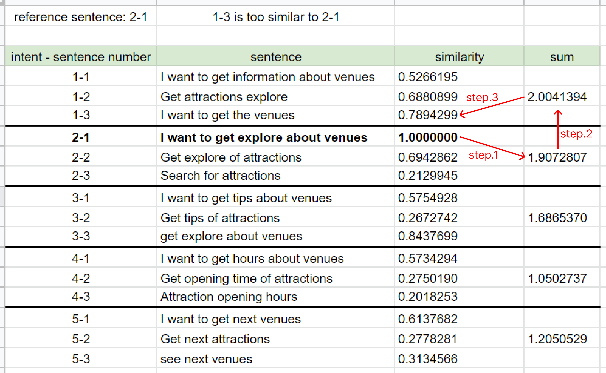

# SCASG

> Sentence Coupling Analysis and Sentence Generation - SCASG

- This is a service for analyzing and generating NLP training sentences based on `TF-IDF`, `WordNet`, and `spaCy`.
- The details are published in 2023 International Computer Symposium (ICS) and accessible [here](https://link.springer.com/chapter/10.1007/978-981-19-9582-8_24).
    - _Best Student Paper_

## Try SCASG

Simply execute the command:

```bash
python app.py
```

And you can use `SCASG` in conjunction with [BOTEN](https://github.com/sheng-kai-wang/BOTEN)

## Concept

### Cohesion and Coupling in NLP Training Sentences

- This research suggests that developers pay attention to the coupling between training sentences, reducing the similarity of sentences belong different Intents, to avoid recognition errors.
- If the meaning of the sentences under the same intent is too similar, the trained NLP model may only be able to judge the sentence input of a single pattern, resulting in `overfitting`.
- In order to avoid the `overfitting` of the model, developers should try to write a variety of training sentence patterns, so this research did not list Cohesion improvement as a research target.
- In our research, we will use `TF-IDF`, `WordNet` and `spaCy` to calculate the similarity between training sentences, and raise warnings for the sentences with similar meanings between different Intents, and suggest developers modify them.

#### TF-IDF Concept

<div></div>

#### Wup_similarity Algorithm of Wordnet

<div></div>

#### Word Embedding Algorithm of spaCy

<div></div>

### Quality Analysis for Training Sentences

#### Steps:
1. Convert all text to lowercase.
2. Lemmatize the words to original.
3. Remove `stop words`.
4. Use `TF-IDF` to calculate the weight of all words in individual sentences, and build a Corpus Index.
5. Represent the constituent words of each training sentence with a weight value, and the sentence can be converted into a one-dimensional vector.
6. Calculate the Cosine Similarity between the sentence vectors to get the similarity value of the two sentences.

<br />

This method may cause two sentences with similar meanings, but the Cosine Similarity is still low because the same words do not appear. Therefore, we propose two improved methods:

#### Improved Method using WordNet:

- Use `WordNet` to look up the synonyms of the words used in the training sentences, and use `spaCy` to calculate the similarity between the synonyms and the original word.
- The weight value of the original word is multiplied by the similarity between the synonym and the original word as the weight value of the synonym in the corpus index.
- We regard these synonyms as the words of the sentences to which the original words belong, and the similarity between all training sentences is recalculated.

<div></div>

#### Improved Method using spaCy:

- `SpaCy` is also used to calculate the similarity between sentences. Since the Corpus of the two calculation methods are different, two different similarity values between the two sentences are obtained, and then these two values are weighted with a specific ratio as the weighted similarity between the two sentences.

#### Determine If Sentence Similarity is too High

By using the above two methods, this system has been able to accurately evaluate the similarity between training sentences, and raise warnings for sentences with excessive similarity but belonging to different Intents. The following is the evaluation method:

1. All the sentences are used as the reference sentence in turn, let all sentences compare with the reference sentence and calculate the similarity, and then add the similarity with same Intent up.
2. Compare these added values.
3. If there is any Intent whose similarity is greater than the Intent which the reference sentence belongs, the sentence with maximum similarity before the Intent is added is regarded as a sentence that is too similar to the reference sentence.

Through the above method, the diversity of sentences under the same Intent can be preserved, and excessive ones can be found.

<div></div>

### Expansion Mechanism for Training Sentences

In addition to the evaluation of training sentences, this research also proposes a mechanism for generating training sentences, and it can be divided into the following steps:

1. Preprocess: converting all text to lowercase, lemmatization, and removing `stop words`.
2. Use `WordNet` to look up the synonyms for each meaningful Token.
3. Calculate the similarity between the synonyms and the original Token through `WordNet`. If the similarity is higher than `0.3`, it will be regarded as a synonym for the token (this value is obtained through our experiments).
4. According to their relative positions in the original sentence, these synonyms will replace the words other than `stop words` in turn to combine multiple sentences with the same meaning as the original sentence.

#### Filtering the Sentences

Among the generated sentences of `WordNet`, some sentences have meanings that are quite different from the original sentence, which could lead to training an inaccurate model, so we further use `spaCy` filtering the sentences, it can be divided into the following steps:

1. Calculate the similarity of generated sentence with the original sentence in turn.
2. Preserve the sentences with a similarity greater than `0.7` as training sentences to complete the expansion (this value is obtained through our experiments).